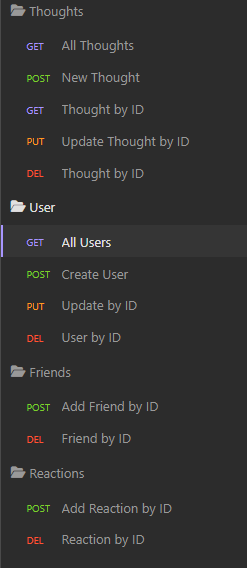

# Social Network API

## Table of Contents
- [Description](#description)
- [Installation](#installation)
- [Usage](#usage)
- [Technologies Used](#technologies)
- [License](#license)
 

## Description
This is an application used to simulate a Social Network environment by using technologies such as NoSQL, MongoDB, Mongoose, Express.js and Nodemon.
 

## Installation
Clone the repository and ensure you have Node.js installed.  
Once you've done that, open the terminal and run `npm install` to install the dependencies.
 

## Usage
[Link to video walkthrough](https://youtu.be/3r45zRw6J4Y)  

Make sure you have MongoDB Installed.  
Set up this environment variable in a ".env" file: `URI_MONGODB='mongodb://127.0.0.1:27017/social-networkDB'`  
Once you've done that, run the `npx nodemon` or `npm start` commands to start the server.  
Use a software such as Insomnia to test the API endpoints.  

## Technologies

- VS Code  
- NodeJS  
- Insomnia  
- JavaScript  
- MongoDB  
- Mongoose  
- Mongo Compass  
- Express.js  

## License
The code in this project is licensed under MIT license.